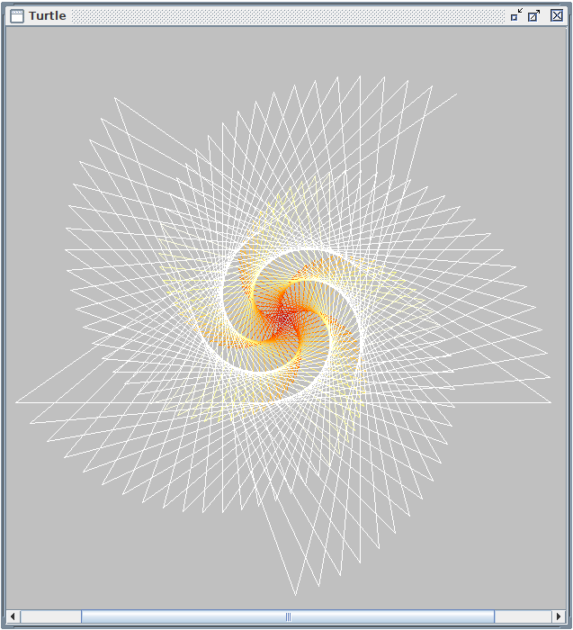

# Turtle

The Turtle project supports a limited set of the Turtle graphics commands you will find in the
[Logo language](https://en.wikipedia.org/wiki/Logo_(programming_language)),
created by [Seymour_Papert](https://en.wikipedia.org/wiki/Seymour_Papert).

Originally I wanted to create a component based calculator but noticed that parsing simple expressions like: ```2 + 3 * 4```, was already quite complex.

When I came across [JavaCC](https://javacc.github.io/javacc/) parsing the above expression was extremely simple and I decided to raise the bar and write my own simple programming language based on Logo.

## The year 2000

At the time the Java language was only a couple of years old.
No generics, no collections API at the time I started writing the code.
No Git (I used Visual Source Safe I think).
Swing was available so I used Swing for the GUI.

## Fast forward to the year 2023

I had a copy of the sources and created this GitHub repository from it.
First thing I created was a pom file so maven can be used for building
this project.

The create-parser.sh script was created and used to generate the different classes from
the turtle.jjt file, which in turn generates a turtle.jj file that again results in
newly generated classes.

Next step was to copy the content of part of the old generated classes into the
newly generated classes. 
Most of the code was related to the interpret method.

Finally I changed almost all classes to support generics, replaced Vector with Lists
et cetera. Replaced some deprecated concepts but all in all, the code did
not require too many changes.

To build the jar file from source simply execute
```mvn package```
The result should be a turtle.jar file in the target folder, which you can run
by executing: ```java -jar target/turtle.jar```

## My interpretation of the Logo language

To see what my language is capable of, you have to read and understand the turtle.jjt file.
What follows are some examples, not a complete description of the Logo language.

### Moving around
Imagine a turtle in the middle of its territory.
You can make the turtle move forward by executing the command "forward number-of-steps",
for example: ```forward 100```.
Now click the "Run" button to see a line.

You can turn the turtle a number of degrees, by executing "right number-of-degrees",
for example: ```right 90```. Now click the "Run" button again.
You should see the turtle moves forward 100 steps again before turning right 90 degrees.
You can't actually see the latter, but you will if you click the run button a couple
of times.
You should now see the letter "P" drawn on your screen.
When you get stuck, execute the following command to clear the screen
and start over.
```clear screen``` and click the "Run" button.

The end result should look like this

 


### Creating a square
Let's try to create a simple square
Clear the content of the Turtle edit frame and start with this command:
```clear screen```.
As its nam implies, it clears the screen, but it will also place the turtle
in the middle, facing north.
Now to create a square execute the following commands:
```
forward 100
right 90
forward 100
right 90
forward 100
right 90
forward 100
right 90
```

We execute the commands "forward 100 and right 90" 4 times.
Logo has a command to repeat instructions, called "repeat".
The code above can be replaced with the much shorter code:
```
clear screen
repeat 4 [
    forward 100
    right 90
]
```

You can even write it on a single line: ```repeat 4 [forward 100 right 90]```
The result should look like this:
 


Now if you need a bigger square you still need to repeat the same code,
where only the size of the square changes.
For this Logo supports learning new functions.

Wipe the content of the "Turtle edit" frame and add the following code.
```
to square :size [
    repeat 4 [forward :size right 90]
]
```
Now run the code to see that nothing happens.
Actually something did happen, the Logo interpreter learned the new
square function.
Again wipe the content of the "Turtle edit" frame and replace it with:
``` square 100``` before running the code.
As you can see, a square is drawn.
Now execute ```square 150``` and notice that a slightly bigger square is drawn.

You have now probably figured out that the ```to``` keyword is used to let
the Turtle interpreter learn new functions and that parameters to a function
are prefixed with a colon.

### Using the square function
As seen in the previous example we can use the new square function,
just like any built in function like ```forward```.

Here is an example where squares are drawn with a slight twist
```
clear screen
repeat 360 / 10 [
    square 100
    right 10
]
```
360 degrees in a circle so we are going to repeat our steps 360 / 10 = 36 times.
We then create our square and turn 10 degrees (since 36 steps * 10 = full circle).

### Enhancing the square function to different types of polygons
The current square function only draws squares, but what if we need a triangle
or a pentagon?
We should be able to write a generic polygon function by now:
```
to polygon :angles :size [    
  repeat :angles [
    forward :size right 360 / :angles
  ]
]
```
Now to create a triangle execute: ```polygon 3, 100```

Note the comma's to separate the arguments to the polygon function.
The new coloredTree function makes it easier to experiment with different sizes and angles.


To create a hexagon execute: ```polygon 6, 100```

A pentagon consists of 5 angles.
Rotating it twice the number of angles crates a nice looking image.
It can be created like this:
```
repeat 10 [
  polygon 5, 100
  right 36
]
```
Creating 10 pentagons where each pentagon is rotated with respect to the other,
results in a nice image.
I wonder if other polygons with n angles, repeated 2 times the number of angels,
also produces a nice image.
We can use the following code to verify this:
```
to rotatingPolygons :angles :size [
  repeat 2 * :angles [
    polygon :angles, 100
    right 360 / (2 * :angles)
  ]
]
```
Just try a few yourself.
For example: ```rotatingPolygons 6, 80```

 


### Creating a binary tree
Now let's try something more ambitious.
Let's create a binary tree.
Enter the following code in the "Turtle edit" frame, before running it.
```
to tree :n [
  if :n > 3 [
    forward :n
    left 15
    tree :n * 3 / 4
    right 30
    tree :n * 3 / 4
    left 15
    back :n
  ]
]
```
At this point Logo knows the new tree function.
Let's call it like this:
```
pen up
back 200
pen down
tree 100
```
First we do a ```pen up``` so we won't draw while moving the turtle.
We then move back to move the turtle to the bottom of the screen,
before putting the pen down again.

Now let's examine the tree function.
It accepts a single parameter :n which is the size of the trunk of the tree (:n).
If the size is larger than 3 the turtle
- moves forward :n steps
- turns left 15 degrees
- recursively draw another tree, three quarters of the original size
- turns right 30 (15 for straight up plus 15)
- recursively draw another tree, three quarters of the original size
- turns left 15 degrees so we are facing straight up again
- moves back the same number steps we initially moved forward

Now see what happens if you change "right 30" to "right 31".
Did you expect that?
Change it back to 30 and replace the first "3 / 4" to "3.2 / 4".
This one was probably a little easier to expect.

Now let's see if we can add some color to our tree and make it more customizable:
```
to coloredTree :size :shorten :angle [
  if :size > 3 [
    pen color :size, 255 - 8 * :size, 0
    forward :size
    left :angle
    coloredTree :size * :shorten, :shorten, :angle
    right :angle * 2
    coloredTree :size * :shorten, :shorten, :angle
    left :angle
    pen up back :size pen down
  ]
]
```
Compared to the previous code we made a couple of changes:
- The new coloredTree function accepts parameters for the size, a factor to shorten the next branch and an angle
- Added a pen color statement
- Surrounded the last back :n with a pen up and pen down

The pen color statement accepts values for red, green and blue.
When the size (:n) is small we are at the top of the tree and we use more green.

The sequence ```pen up back :n pen down``` is necessary to keep the previously 
drawn color.

To get the same result as before, execute:
```
clear screen
pen up back 200 pen down
coloredTree 100, 0.75, 15
```

 

### Creating some spirals

We create a spiral function by:
- moving forward a particular size
- turning right
- repeating the process, but with a slightly larger size

A function to accomplish this may look like this

; spiralIncSize
; Creates a spiral where the size of the spiral is incremented.
; param :size Initial distance traveled by the turtle before a turn is made.
; param :angle Degrees the turtle will turn.
; param :increment Value that will be added to the :side
; param :count Number of lines to draw for this spiral.
```
to spiralIncSize :size :angle :increment :count [
  if :count > 0 [
    ; pen color  :size + :count, :size, :size - :count
    forward :size
    right :angle
    spiralIncSize :size + :increment, :angle, :increment, :count -1
  ]
]
```
We introduced a new concept of comments, which can be added to the source code
by using a semi-colon.
For a simple spiral use:
```
clear screen
spiralIncSize 1, 45, 1, 300
```
The initial size is one, the angle is 45 degrees and we increment the size by 1.
In total 300 line segments are drawn.
Notice the commented out pen color statement?
Remove the semi-colon and execute the same code agin.

Some other values you might try are:
```spiralIncSize 1, 145, 3, 200``` and ```spiralIncSize 1, 151, 3, 200```.

The first spiral (with the uncommented pen color statement, looks like this):
 


Now let's create a function where we don't increase the size of the spiral,
but the size of the angle.
```
; spiralIncAngle
; Creates a spiral where the angle is incremented after a line is drawn.
; param :size Distance traveled by the turtle before a turn is made.
; param :angle Initial degrees the turtle will turn.
; param :increment Value that will be added to the :angle
; param :count Number of lines to draw for this spiral.
to spiralIncAngle :size :angle :increment :count [
  if :count > 0 [
    forward :size
    right :angle
    spiralIncAngle :size, :angle + :increment, :increment, :count -1
  ]
]
```

Try this code with the following parameters:
```spiralIncAngle 50, 135, 4, 400``` and ```spiralIncAngle 50, 17, 6, 400```

Bet you did not see that coming did you?
Here is an example:

 


 


